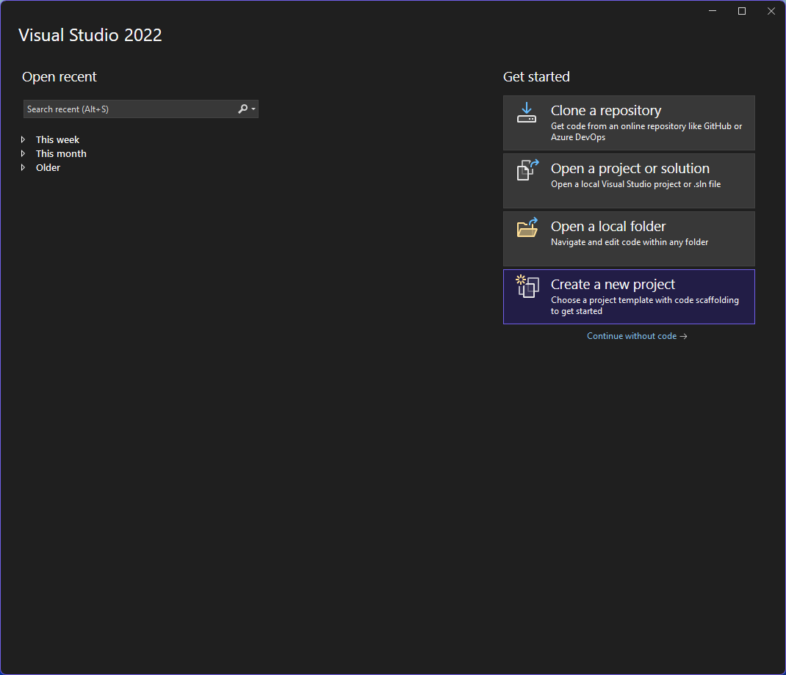

# "Using Blazor" lessons in 2025 Q1. Published under MIT No AI Licence.

- [License](LICENSE.md)

## Lesson 00 - Setup

First, its up to you to setup the solution we will learn on. Therefore ensure you meet the prequisites:

- Get a suitable OS, Windows 11 recommended.
- Install .NET 9.0 SDK. Older Ubuntu releases require additional apt setup. See [Microsoft Learn](https://learn.microsoft.com/en-us/dotnet/core/install/linux-ubuntu-install?tabs=dotnet9&pivots=os-linux-ubuntu-2204)
- Install IDE, Visual Studio 2022 recommended.
- Recommended Microsoft Edge.

Other OS & IDEs would also work, but may not match the sceenshots provided for each lesson.
Any (Cromium-based) browser will do it, as long it is configured for development and supports WASM etc.

### 00 - Select - Create a new project

### 01 - Select - Blazor Web App

### 02 - Configure project name and location

### 03 - Configure framework and auto mode

### 04 - Run Debug

