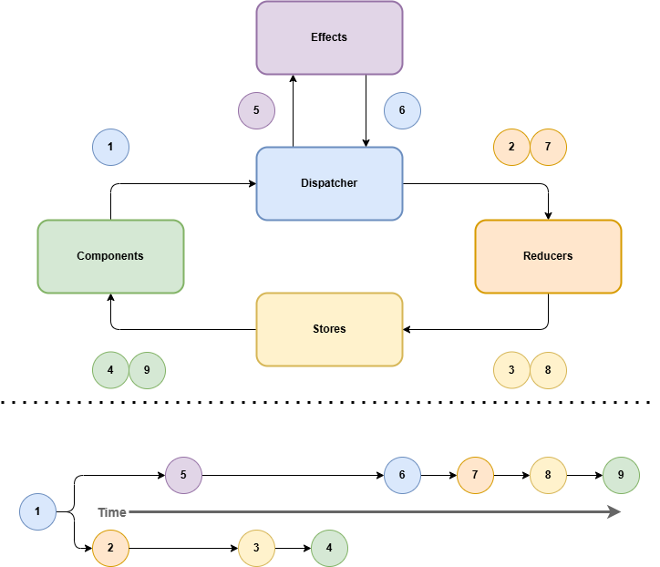
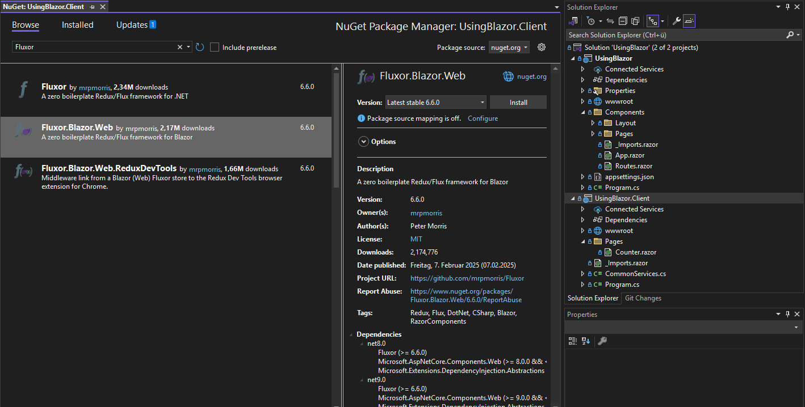
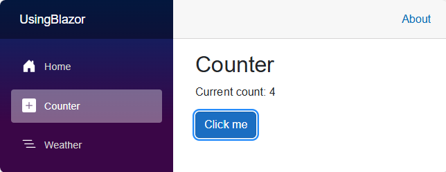
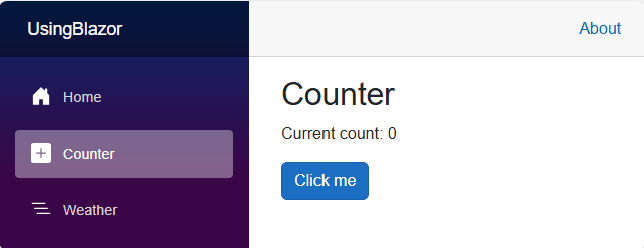

# "Using Blazor" Lessons in 2025 Q1

Published under MIT No AI Licence:

- [License](LICENSE.md)

## Lesson 02 - State Management with the Flux pattern

It is important to clearify the role of Redux, because there is often a lot of confusion about it.
First, Redux is an implementation of the Flux pattern. It has its roots in the apple/swift ecosystem, so I have been told (not verified).
Redux was very successful in the successful SPA frameworks. Secend, it came with the Redux Dev Tools, which is a independent powerful tool, not an inherent part.

### 00 - The Flux Pattern

Itself, the Flux pattern defines a technology independent concept to manage states in a standardized control loop. Later the "inner" control loop was extended by the "outer" control loop.

The inner control loop defines
- Components - produce Actions by user interactions or technical triggers.
- Dispatcher - takes occuring Actions and dispatches them to consumers.
- Reducers - the consumers of the inner control loop.
- Stores - Immutable in memory states, used as data sources for Components.

Remarks: Who feels reminded of WPF MVVM is not wrong. The intention of decoupling is the same.

The outer control loop defines
- Effects - consumers (and producers) to standardize remote requests and their reasults into the flux pattern.





Its important to understand the timing behind. The inner control loop is local and always faster than the remote working outer control loop.
For the typical timeline of any use case imagine following scenario:

1. A user defines some filters and sends out a query to a bigger database in the backend. Therfore an action is dispached in the code, containing the filter's data.
2. ALL Reducers which match the action type receive the action and apply it to the related stores. When more than one store should be affected, you need one reducer per store.
3. Related stores are updated and bound components are marked for rerendering. In our case, the data is not fetched till now. So a boolean called "showSpinner" is set to true.
4. Components are rendered and will show a spinner instead of a datatable.
5. When (2) is performed ALL effects which match the action type receive the action as well.
6. Responses to these request will take some time and the results are dispatched again. Trick: Every response is an action, same like 1.
7. Same like 2.
8. Same like 3, but "showSpinner" is set to false.
9. Components are rendered and will show the fetched data.

### 01 - NuGet - Fluxor

Starting fram the heavy classic Redux there are a lot of implementations of even more lightweight frameworks like "Zustand" in React or embedded like in Angular.

And within the Blazor world? We are very happy! We got Fluxor!
You find this gem on [GitHub Fluxor](https://github.com/mrpmorris/Fluxor) and on [nuget.org](https://www.nuget.org/packages/Fluxor).



**Auto Mode**
Add the Fluxor to both of your project `UsingBlazor` and `UsingBlazor.Client`.

### 02 - Code - Add to CommonServices

As we already prepared the `CommonServices` we have to add Fluxor once to DI.

```
using Fluxor;

namespace UsingBlazor.Client;

public static class CommonServices
{
    public static void ConfigureServices(IServiceCollection services)
    {
        var currentAssembly = typeof(Program).Assembly;
        services.AddFluxor(options => options.ScanAssemblies(currentAssembly));
    }
}
```

As you see Fluxor comes with extension methods for the `IServiceCollection`. The `FluxorOptions` need to know where it should look for types with Fluxor annotations.
We have two assemblies which may contain Fluxor annotations: `UsingBlazor` and `UsingBlazor.Client`. Both will call `CommonServices.ConfigureServices`.
In both cases `typeof(Program).Assembly` deliver the `currentAssembly` correctly. This needs to be extended, so keep that in mind for later lessons.

### 03 - Run - Counter without Fluxor

Let's run the app and inspect the Counter page from Microsoft's demo pages.

1. Navigate to *Counter*.
2. Click multiple time on *Click me*. Current count is increasing as expected.



3. Navigate to *Home*.
4. Navigate to *Counter*.



As you can see the previous data is lost. Now we will change that.

### 04 - Code - Enable StoreInitializer

Before any store can work, we have add the `Fluxor.Blazor.Web.StoreInitializer` component to the `App.razor` in the `UsingBlazor` project.

**Auto Mode**
For Interactive Auto mode the attribute `@rendermode` on the component has to be set to `"new InteractiveAutoRenderMode()"`.

```
<!DOCTYPE html>
<html lang="en">

<head>
    <meta charset="utf-8" />
    <meta name="viewport" content="width=device-width, initial-scale=1.0" />
    <base href="/" />
    <link rel="stylesheet" href="@Assets["lib/bootstrap/dist/css/bootstrap.min.css"]" />
    <link rel="stylesheet" href="@Assets["app.css"]" />
    <link rel="stylesheet" href="@Assets["UsingBlazor.styles.css"]" />
    <ImportMap />
    <link rel="icon" type="image/png" href="favicon.png" />
    <HeadOutlet />
    <Fluxor.Blazor.Web.StoreInitializer @rendermode="new InteractiveAutoRenderMode()" />
</head>

<body>
    <Routes />
    <script src="_framework/blazor.web.js"></script>
</body>

</html>
</html>
```

### 05 - Code - Create the Actions

First, we define the required actions. The only requirement is simple: the user clicks a button and count is incremented.
So we define the action `Increment` in a new classfile `CounterActions`.

**Recommendations**
- Place the file directly to the `Counter.razor`.
- Use `record struct` to ensure immutability out-of-the-box.

**Clarifications**
- The outer static class is just usedto group Api members. There is no need or functional effect besides that.

```
namespace UsingBlazor.Client.Pages;

public static class CounterActions
{
    public record struct Increment();
}
```

### 04 - Code - Create the Store

Next, we implement the `CounterStore`. Stores have to be immutable. So we provide a read-only property which stores the `ClickCount`.
Then two constructors are required. A default contructor for the initialization, setting the `ClickCount` to `0`.
The second constructor is used to create a new store instance with the values of the previous.
The class needs to be annotated with `[FeatureState]`. This is one of the attributes Fluxor is scanning assemblies for.

**Recommendations**
- Place the file directly to the `Counter.razor`.

```
using Fluxor;

namespace UsingBlazor.Client.Pages;

[FeatureState]
public class CounterState
{
    public int ClickCount { get; }

    public CounterState() { } // Required for creating initial state.

    public CounterState(int clickCount)
    {
        ClickCount = clickCount;
    }
}
```

### 06 - Code - Using Store and Dispatcher in a Fluxor Component

Finally, we are ready to change the `Counter.razor`.

#### Original
```
@page "/counter"
@rendermode InteractiveAuto

<PageTitle>Counter</PageTitle>

<h1>Counter</h1>

<p role="status">Current count: @currentCount</p>

<button class="btn btn-primary" @onclick="IncrementCount">Click me</button>

@code {
    private int currentCount = 0;

    private void IncrementCount()
    {
        currentCount++;
    }
}
```

#### Using, Inherits and Injects
First we inherit the component from `FluxorComponent`. This allows to subscribe to Fluxor events.
Then `IDispatcher` and `CounterStore` are injected.

```
@page "/counter"
@rendermode InteractiveAuto

@using Fluxor
@inherits Fluxor.Blazor.Web.Components.FluxorComponent
@inject IState<CounterState> CounterState
@inject IDispatcher Dispatcher

<PageTitle>Counter</PageTitle>

<h1>Counter</h1>

<p role="status">Current count: @currentCount</p>

<button class="btn btn-primary" @onclick="IncrementCount">Click me</button>

@code {
    private int currentCount = 0;

    private void IncrementCount()
    {
        currentCount++;
    }
}
```

#### Dispatch Action
(Yes, the predicate could be inlined.)
```
@page "/counter"
@rendermode InteractiveAuto

@using Fluxor
@inherits Fluxor.Blazor.Web.Components.FluxorComponent
@inject IState<CounterState> CounterState
@inject IDispatcher Dispatcher

<PageTitle>Counter</PageTitle>

<h1>Counter</h1>

<p role="status">Current count: @currentCount</p>

<button class="btn btn-primary" @onclick="IncrementCount">Click me</button>

@code {
    private int currentCount = 0;

    private void IncrementCount() => Dispatcher.Dispatch(new CounterActions.Increment());
}
```

#### Replace local variable and bind to the Store
```
@page "/counter"
@rendermode InteractiveAuto

@using Fluxor
@inherits Fluxor.Blazor.Web.Components.FluxorComponent
@inject IState<CounterState> CounterState
@inject IDispatcher Dispatcher

<PageTitle>Counter</PageTitle>

<h1>Counter</h1>

<p role="status">Current count: @CounterState.Value.ClickCount</p>

<button class="btn btn-primary" @onclick="IncrementCount">Click me</button>

@code {
    private void IncrementCount() => Dispatcher.Dispatch(new CounterActions.Increment());
}
```

Success: When you run the app and click the button nothing will happen. ;-P

Joking aside. The business logic (`currentCount++`) is gone.

### 07 - Code - Create the Reducers

Business logic changes data. The data goes to the store. The changes go to the reducers.
So we define the action `Increment` in a new classfile `CounterReducers`. The method signature is fixed, the name irrelevant.

**Recommendations**
- Place the file directly to the `Counter.razor`.
- Make the class static as well.

```
using Fluxor;

namespace UsingBlazor.Client.Pages;

public static class CounterReducers
{
    [ReducerMethod]
    public static CounterState Increment(CounterState state, CounterActions.Increment _)
        => new(clickCount: state.ClickCount + 1);
}
```

The method returns the new instance of the `CounterState`.

**Run and test. The click counter is preserved now.**