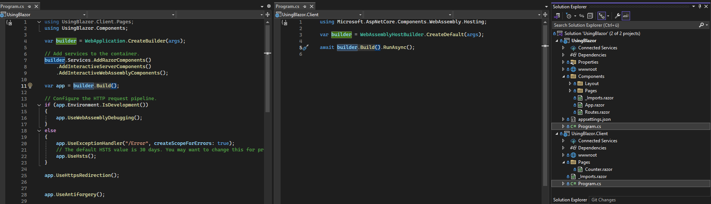
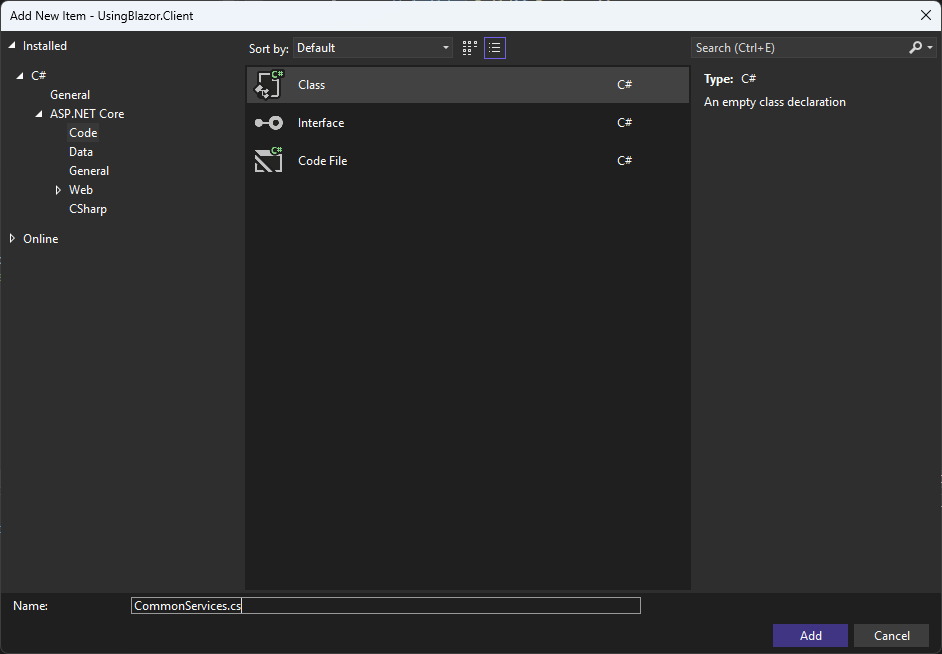
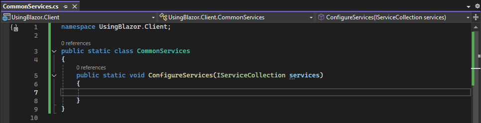
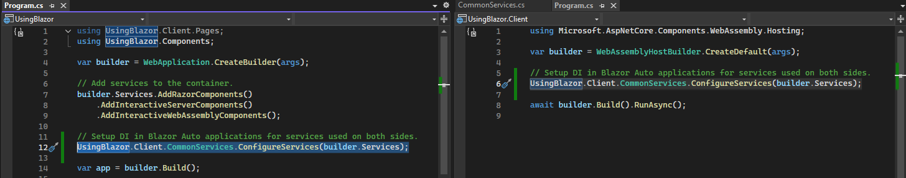

# "Using Blazor" Lessons in 2025 Q1

Published under MIT No AI Licence:

- [License](LICENSE.md)

## Lesson 01 - Auto Mode and DI

Additionally to existing Blazor Render Modes
- Static server-side
- Interactive server-side
- Interactive WebAssembly client-side

Microsoft introduced with .NET 8.0
- Interactive Auto

In the Auto Render Mode pages are rendered first on server side, later on client side.
This results in various questions to the code structure:
Where to place Components?
How to handle runtime behavior in the application lifecycle, expecially the dependency injection?

Good things first: at compile-time most things are settled.
Open point: dependency injection
Question: in which di-container-instance is an instance?

### 00 - View - Program & Program

### 01 - Create - Common Services

### 02 - Code - Static helper stub for DI

### 03 - Code - Call common services with builder services

